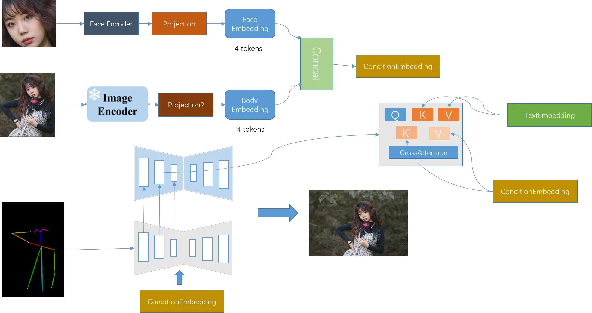

# Acknowledgement
Hi, all. This is the code for Jiaolun Zhou's project FaceCDM guided by Prof. Luyao Zhang and Prof. Dongmian Zou.

# Introduction
The rise of diffusion models has sparked significant interest in controllable text-to-image generation. Current methods often rely on fixed face IDs, which can lead to semantic inaccuracies and high computational costs. To tackle these challenges, we present FaceCDM, a novel framework that uses face detection and feature extraction to integrate face attributes directly into diffusion models during training. FaceCDM introduces a triplet cross-attention mechanism that effectively learns the interplay between text, images, and face IDs. This mechanism is part of a pre-training network, and we employ a three-stage training strategy to refine the integration of text and face ID features, from broad strokes to fine details. Extensive testing shows that FaceCDM excels at generating images that accurately match the given prompts and face ID specifications. In the future, this technology should find its way into online virtual fitting rooms, meta-universes and the like.

# Guidance
How to learn about how to run this code so that everyone can generate a fixed-face image for themselves? In this github, we provide the users with two different methods:

- 1. The mp4 file is about how to run this code. It shows in-detail process about how to run the code, including installing the necessary package and environment preparation. If you follow this mp4 file and you will be able to run the code.
- 2. We also provide you with a google colab link. You only need to substitute the picture named by result1.png with your own photo and change the describing words for the generated picture in the second cell and every thing is done. Here is the link: https://colab.research.google.com/drive/1TzYDQEiXMwKK-HXqU1OfplL2D3HeQegt?usp=sharing

# Brief Explanation

There are several steps that this model follows to generate pictures:
- 1.We separate the face from the image and extract the face features using faceencoder, then we use imageencoder to extract the features of the whole image.
- 2.We use action feature recognition to extract the pose of the person in the image and feed it into a control-net for training, the purpose of this is to reduce the blurriness of face generation by introducing new features.
- 3.During the training process we first perform a dimensionality reduction of the features in order to reduce the number of unnecessary features and limit the number of features learned by the model to ensure that it learns the most useful ones. Then we uplift the features in order to avoid the model ignoring important features.
- 4.We use cross-attention to combine the text features with the face features taken out earlier and put them into u-net for specific image generation under the control of control-net.

# Open-Source for all packages
All the hugging face packages used in this model are open-source, here we also provide the link to their website:

- insightface: https://github.com/deepinsight/insightface?spm=5176.28103460.0.0.5b385d27fnNr6t
- ipadaptor: https://github.com/huggingface/transformers/tree/master/examples/research_projects/ip-adapter?spm=5176.28103460.0.0.5b385d27fnNr6t
- huggingface models: https://huggingface.co/models?spm=5176.28103460.0.0.5b385d27fnNr6t
